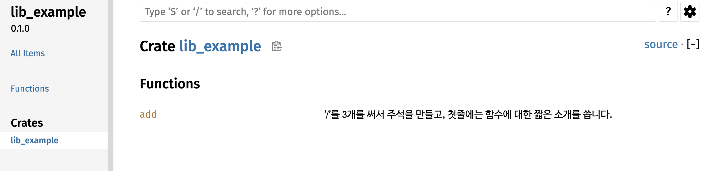
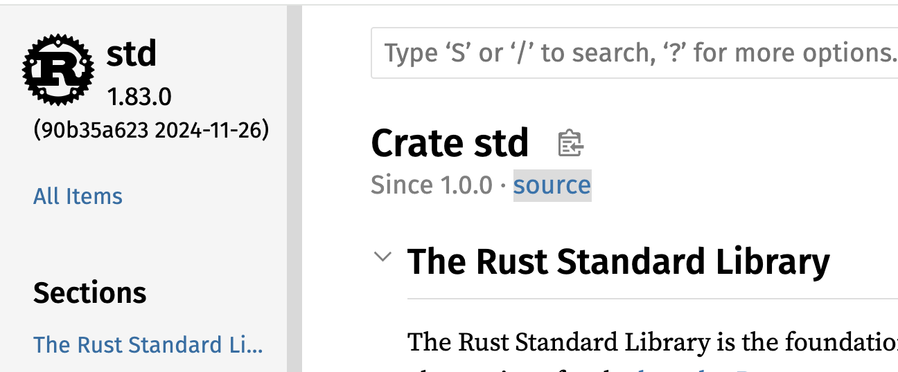
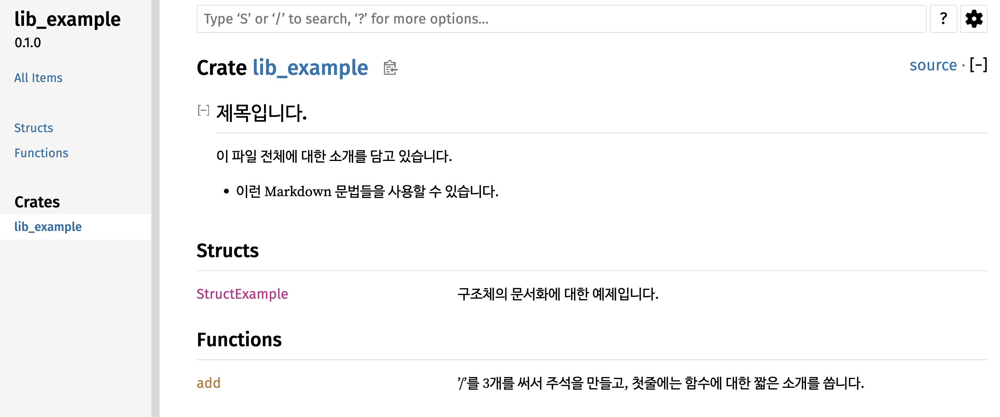

# `Cargo` 툴 소개

러스트 언어의 컴파일러는 `rustc`라는 툴입니다. 하지만 `rustc`를 직접 실행하는 일은 거의 없습니다. 대신 `Cargo`를 사용합니다. `Cargo`가 무엇인지, 어떤 일들을 해주는지 알아보겠습니다.

가장 먼저 `Cargo`의 `help` 메시지를 보면 러스트의 패키지 관리를 위한 툴이라고 설명합니다.

```bash
quick-guide-rust-programming $ cargo help
Rust's package manager

Usage: cargo [+toolchain] [OPTIONS] [COMMAND]
       cargo [+toolchain] [OPTIONS] -Zscript <MANIFEST_RS> [ARGS]...

Options:
  -V, --version             Print version info and exit
      --list                List installed commands
      --explain <CODE>      Provide a detailed explanation of a rustc error message
  -v, --verbose...          Use verbose output (-vv very verbose/build.rs output)
  -q, --quiet               Do not print cargo log messages
      --color <WHEN>        Coloring: auto, always, never
  -C <DIRECTORY>            Change to DIRECTORY before doing anything (nightly-only)
      --locked              Assert that `Cargo.lock` will remain unchanged
      --offline             Run without accessing the network
      --frozen              Equivalent to specifying both --locked and --offline
      --config <KEY=VALUE>  Override a configuration value
  -Z <FLAG>                 Unstable (nightly-only) flags to Cargo, see 'cargo -Z help' for details
  -h, --help                Print help

Commands:
    build, b    Compile the current package
    check, c    Analyze the current package and report errors, but don't build object files
    clean       Remove the target directory
    doc, d      Build this package's and its dependencies' documentation
    new         Create a new cargo package
    init        Create a new cargo package in an existing directory
    add         Add dependencies to a manifest file
    remove      Remove dependencies from a manifest file
    run, r      Run a binary or example of the local package
    test, t     Run the tests
    bench       Run the benchmarks
    update      Update dependencies listed in Cargo.lock
    search      Search registry for crates
    publish     Package and upload this package to the registry
    install     Install a Rust binary
    uninstall   Uninstall a Rust binary
    ...         See all commands with --list
See 'cargo help <command>' for more information on a specific command.
```

여기에서 패키지는 일반적으로 생각하는 하나의 소프트웨어 설치 파일인 `rpm`이나 `deb` 파일을 말할 때 사용하는 패키지가 아닙니다. 러스트에서는 우리가 개발하는 프로젝트를 패키지라고 부릅니다. 패키지를 관리하는 툴이라는 의미는 프로젝트를 개발하는 모든 단계에서 사용되는 툴이라는 의미입니다. 프로젝트 개발을 위한 컴파일, 프로젝트 전체 빌드(`Build`), 외부 크레이트(러스트에서는 외부 라이브러리를 크레이트[`Crate`]라고 부릅니다) 다운로드, 실행 파일 설치 등 개발 과정의 모든 일을 처리할 수 있습니다. 보통 다른 언어에서는 별도의 툴을 사용해야 하는 코드 주석의 문서화(`Doc`) 기능이나 코드 정렬(`fmt`) 등의 기능들도 포함되어 있습니다.

그리고 `help` 메시지에 나오는 명령어 리스트가 전체 리스트는 아닙니다. 주로 많이 사용되는 명령어들만 보여주고 있습니다. 전체 명령어 리스트를 보려면 `cargo --list` 명령을 사용합니다.

```bash
user@AL02279337 quick-guide-rust-programming % cargo --list
Installed Commands:
    add                  Add dependencies to a Cargo.toml manifest file
    b                    alias: build
    bench                Execute all benchmarks of a local package
    build                Compile a local package and all of its dependencies
    c                    alias: check
    check                Check a local package and all of its dependencies for errors
    clean                Remove artifacts that cargo has generated in the past
    clippy               Checks a package to catch common mistakes and improve your Rust code.
    config               Inspect configuration values
    d                    alias: doc
    doc                  Build a package's documentation
    expand
    fetch                Fetch dependencies of a package from the network
    fix                  Automatically fix lint warnings reported by rustc
    fmt                  Formats all bin and lib files of the current crate using rustfmt.
    generate-lockfile    Generate the lockfile for a package
    git-checkout         This command has been removed
    help                 Displays help for a cargo subcommand
    info                 Display information about a package in the registry
    init                 Create a new cargo package in an existing directory
    install              Install a Rust binary
    locate-project       Print a JSON representation of a Cargo.toml file's location
    login                Log in to a registry.
    logout               Remove an API token from the registry locally
    metadata             Output the resolved dependencies of a package, the concrete used versions including overrides, in machine-readable format
    miri
    new                  Create a new cargo package at <path>
    owner                Manage the owners of a crate on the registry
    package              Assemble the local package into a distributable tarball
    pkgid                Print a fully qualified package specification
    publish              Upload a package to the registry
    r                    alias: run
    read-manifest        Print a JSON representation of a Cargo.toml manifest.
    remove               Remove dependencies from a Cargo.toml manifest file
    report               Generate and display various kinds of reports
    rm                   alias: remove
    run                  Run a binary or example of the local package
    rustc                Compile a package, and pass extra options to the compiler
    rustdoc              Build a package's documentation, using specified custom flags.
    search               Search packages in the registry. Default registry is crates.io
    t                    alias: test
    test                 Execute all unit and integration tests and build examples of a local package
    tree                 Display a tree visualization of a dependency graph
    uninstall            Remove a Rust binary
    update               Update dependencies as recorded in the local lock file
    vendor               Vendor all dependencies for a project locally
    verify-project       Check correctness of crate manifest
    version              Show version information
    yank                 Remove a pushed crate from the index
```

특정 명령어에 대한 자세한 설명을 보고 싶으면 `cargo help <명령어>`를 사용합니다. 리눅스의 매뉴얼 페이지와 동일한 형태의 매뉴얼을 볼 수 있습니다.

```
user@AL02279337 quick-guide-rust-programming % cargo help add
CARGO-ADD(1)                           General Commands Manual                           CARGO-ADD(1)

NAME
       cargo-add — Add dependencies to a Cargo.toml manifest file

SYNOPSIS
       cargo add [options] crate…
       cargo add [options] --path path
       cargo add [options] --git url [crate…]

DESCRIPTION
       This command can add or modify dependencies.
......
```

지금부터 제가 개발하면서 자주 사용하는 명령어들을 짧게 소개하겠습니다.

## `cargo new`

현재 디렉터리에 새로운 패키지를 위한 디렉터리를 만들고, `Cargo.toml` 파일과 `.gitignore` 파일 등 개발을 시작하기 위해 필요한 파일들을 자동으로 생성해 줍니다. 가장 많이 사용하는 옵션은 `--bin`과 `--lib` 두 가지입니다. `--bin` 옵션은 실행 파일을 만들기 위한 패키지를 생성합니다. 지금 예제 파일들의 구조를 보면 전부 `src/main.rs` 파일을 가지고 있습니다. 실행 파일을 만들기 위한 패키지이기 때문에 `--bin` 옵션을 이용해서 만들어졌습니다. `--bin` 옵션으로 패키지를 하나 생성해 보겠습니다.

```bash
$ cargo new --bin bin-example
    Creating binary (application) `bin-example` package
bin-example $ ls -a
.          ..         .git       .gitignore Cargo.toml src
```

`bin-example`이라는 이름의 패키지를 만들었습니다. 바이너리, 즉 실행 파일(`Application`)을 만들기 위한 패키지입니다. `bin-example` 디렉터리에는 `Git`을 위한 `.git` 디렉터리와 `.gitignore` 파일이 생성되었습니다. 그리고 `Cargo`가 프로젝트 관리를 위해 사용하는 `Cargo.toml` 파일과 소스를 저장할 `src` 디렉터리가 생성되었습니다. `src/main.rs` 파일에는 간단한 예제가 들어 있습니다.

```rust
bin-example $ cat src/main.rs
fn main() {
    println!("Hello, world!");
}
```

`--lib` 옵션은 라이브러리를 만들기 위한 패키지를 생성할 때 사용합니다. `src/main.rs`가 아니라 `src/lib.rs` 파일을 생성합니다.

```
 $ cargo new --lib lib-example
    Creating library `lib-example` package
note: see more `Cargo.toml` keys and their definitions at https://doc.rust-lang.org/cargo/reference/manifest.html
$ cd lib-example
lib-example $ ls -a
.          ..         .git       .gitignore Cargo.toml src
lib-example % ls src/
lib.rs
```

`lib.rs` 파일에는 간단한 함수의 예제와 유닛 테스트(`Test`) 예제가 들어 있습니다.

```rust
% cat src/lib.rs
pub fn add(left: u64, right: u64) -> u64 {
    left + right
}

#[cfg(test)]
mod tests {
    use super::*;

    #[test]
    fn it_works() {
        let result = add(2, 2);
        assert_eq!(result, 4);
    }
}
```

참고로 `.git` 디렉터리가 생성되었다고 해서 `GitHub`이나 자신이 사용하는 저장소와 연결되었다는 것은 아닙니다. `git remote -v` 명령을 실행해 보면 아무런 저장소도 설정되지 않았음을 확인할 수 있습니다. 본인이 사용하는 저장소의 매뉴얼을 참고하여 저장소 연결 설정을 해주어야 합니다.

## `cargo check`

패키지를 생성했다면 `cargo check` 명령으로 컴파일러가 제대로 설치되었는지, 개발 환경 설정이 준비되었는지 등을 확인해 볼 수 있습니다. 소스 코드에 에러가 없는지까지 확인하기 때문에 사실상 `cargo build` 명령과 차이가 없어 보입니다. 하지만 `build` 명령보다 `check` 명령을 먼저 소개하는 이유가 있습니다. `build` 명령은 패키지를 빌드하여 최종 실행 파일까지 생성하지만, `check` 명령은 실행 파일 생성 없이 에러만 체크합니다. 그래서 `check` 명령이 더 빠릅니다. 개발하면서 새로 작성한 코드에 에러가 없는지 확인하기 위해 컴파일러를 실행하여 실행 파일을 만들어본 경험이 많을 것입니다. 하지만 생성된 실행 파일을 매번 실행하지는 않습니다. 실행 파일을 만드는 시간만 낭비되는 셈입니다. `build` 명령보다 `check` 명령을 더 자주 사용하면 시간을 아낄 수 있습니다. 얼마나 시간이 절약되는지 비교해 보겠습니다.

```bash
bin-example $ cargo check
    Checking bin-example v0.1.0 (/Users/user/study/bin-example)
    Finished `dev` profile [unoptimized + debuginfo] target(s) in 0.29s
bin-example $ cargo build
   Compiling bin-example v0.1.0 (/Users/user/study/bin-example)
    Finished `dev` profile [unoptimized + debuginfo] target(s) in 0.66s
```

`check` 명령이 `build`에 비해 절반의 시간만 사용합니다. 지금은 아주 간단한 예제이므로 차이가 미미해 보일 수 있습니다. 하지만 패키지 규모가 커지면 `cargo build` 명령에 시간이 더 걸려 답답함을 느낄 수 있습니다. 러스트 컴파일러는 메모리 관리를 위한 다양한 기능을 수행하므로 컴파일 속도가 느린 것으로 유명합니다. 단순히 문법 에러가 없는지 확인할 때는 `build` 명령 대신 `check` 명령을 사용하는 것을 권장합니다.

## `cargo build`

최종 실행 파일을 만들기 위해서는 `build` 명령을 사용해야 합니다. `Cargo`는 `target/debug` 디렉터리를 만들고 생성된 실행 파일을 저장합니다. 다음은 `bin-example` 패키지의 `target/debug` 디렉터리에 있는 `bin-example` 실행 파일을 실행한 결과입니다.

```bash
bin-example $ cargo build
   Compiling bin-example v0.1.0 (/Users/user/study/bin-example)
    Finished `dev` profile [unoptimized + debuginfo] target(s) in 0.29s
bin-example $ ls target 
CACHEDIR.TAG debug
bin-example $ ls target/debug 
bin-example   bin-example.d build         deps          examples      incremental
bin-example $ ./target/debug/bin-example
Hello, world!
```

디렉터리 이름이 `debug`인 것에서 알 수 있듯이, `build` 명령에 옵션을 주지 않으면 디버깅 정보가 포함된 실행 파일을 만듭니다. 이는 제품으로 출시하기 위한 실행 파일은 아닙니다. 릴리스(`Release`) 모드의 실행 파일을 만들기 위해서는 `--release` 옵션을 주어야 합니다. 다음은 릴리스 모드의 실행 파일을 만든 결과입니다.

```bash
bin-example $ cargo build --release
   Compiling bin-example v0.1.0 (/Users/user/study/bin-example)
    Finished `release` profile [optimized] target(s) in 0.84s
bin-example $ ls target/release/
bin-example   bin-example.d build         deps          examples      incremental
```

디렉터리 이름이 `release`로 바뀌었습니다. 그 외에 생성된 파일이나 디렉터리 구성은 동일합니다.

빌드로 생성된 파일들을 지우기 위해서는 `clean` 명령을 사용합니다.

```bash
bin-example $ ls  
Cargo.lock Cargo.toml src        target
bin-example $ cargo clean
     Removed 11 files, 760.6KiB total
bin-example $ ls
Cargo.lock Cargo.toml src
```

## `cargo run`

실행 파일을 간편하게 실행하기 위해 `run` 명령이 있습니다. 패키지에서 생성하는 실행 파일이 1개라면 옵션이 필요 없지만, 여러 개라면 다음과 같이 `--bin` 옵션으로 실행 파일 이름을 지정해 줄 수 있습니다. 다음은 이 책의 예제 코드를 다운로드한 후 `function_for`라는 실행 파일을 빌드하고 실행한 결과입니다.

```bash
$ cargo build --bin function_for
   Compiling my-rust-book v0.1.0 (/home/gurugio/my-rust-book)
    Finished dev [unoptimized + debuginfo] target(s) in 0.17s
$ cargo run --bin function_for
    Finished dev [unoptimized + debuginfo] target(s) in 0.00s
     Running `target/debug/function_for`
Hello, function_for!
3 - Fizz
5 - Buzz
6 - Fizz
9 - Fizz
10 - Buzz
```

또한 프로그램이 커맨드 라인 옵션을 받는 경우, `cargo run` 명령에 옵션을 추가할 수 있습니다.
아래는 `Clap`이라는 크레이트의 예제 코드를 실행하는 모습입니다.
이 예제는 `--help`, `--version` 등 총 4개의 옵션을 받을 수 있습니다.
개발 중에는 바이너리를 직접 실행하는 대신 `cargo run` 명령으로 바로 실행하며 옵션을 전달할 수 있으면 편리합니다.

```bash
$ demo --help
A simple to use, efficient, and full-featured Command Line Argument Parser

Usage: demo[EXE] [OPTIONS] --name <NAME>

Options:
  -n, --name <NAME>    Name of the person to greet
  -c, --count <COUNT>  Number of times to greet [default: 1]
  -h, --help           Print help
  -V, --version        Print version

$ demo --name Me
Hello Me!
```

예제 코드가 `--help` 옵션을 처리할 수 있다고 해서 `cargo run --help`를 입력하면, 예제 코드가 아닌 `cargo run` 자체가 처리하는 옵션들이 출력됩니다. 예제 코드에 `--help` 옵션을 전달하려면 다른 방법이 필요합니다.

```bash
% cargo run --help  
Run a binary or example of the local package

Usage: cargo run [OPTIONS] [ARGS]...

Arguments:
  [ARGS]...  Arguments for the binary or example to run

Options:
      --message-format <FMT>  Error format
  -v, --verbose...            Use verbose output (-vv very verbose/build.rs output)
  -q, --quiet                 Do not print cargo log messages
      --color <WHEN>          Coloring: auto, always, never
      --config <KEY=VALUE>    Override a configuration value
  -Z <FLAG>                   Unstable (nightly-only) flags to Cargo, see 'cargo -Z help' for details
  -h, --help                  Print help
......생략
```

`cargo run` 명령에서 `Cargo` 자체 옵션이 아닌 실행할 바이너리에 전달할 옵션은 다음과 같이 `--` 다음에 적어줍니다. 아래 예제는 `demo --help`와 동일한 결과를 보여줍니다.

```
$ cargo run -- --help
    Finished `dev` profile [unoptimized + debuginfo] target(s) in 0.10s
     Running `target/debug/bin-example --help`
Simple program to greet a person

Usage: bin-example [OPTIONS] --name <NAME>

Options:
  -n, --name <NAME>    Name of the person to greet
  -c, --count <COUNT>  Number of times to greet [default: 1]
  -h, --help           Print help
  -V, --version        Print version
$ cargo run -- -n Gioh --count 2
    Finished `dev` profile [unoptimized + debuginfo] target(s) in 0.05s
     Running `target/debug/bin-example -n Gioh --count 2`
Hello Gioh!
Hello Gioh!
```

`--` 다음에 전달한 `-n Gioh --count 2` 옵션이 `Cargo`가 아닌 예제 코드로 전달되어 실행되었습니다.

## `cargo search`와 `cargo add`

프로젝트를 진행하다 보면 다양한 외부 크레이트(`Crate`)가 필요합니다. [crates.io](https://crates.io/) 사이트에서 검색할 수도 있지만, `cargo search` 명령을 사용할 수도 있습니다. `anyhow` 크레이트를 검색해 보겠습니다.

```bash
bin-example % cargo search anyhow
anyhow = "1.0.94"                # Flexible concrete Error type built on std::error::Error
anyhow-tauri = "1.0.0"           # A crate that lets you use anyhow as a command result with the tauri framework.
anyhow_ext = "0.2.1"             # Extension of anynow
anyhow-std = "0.1.4"             # Wrap std APIs with anyhow error context.
spark-market-sdk = "0.6.6"       # SDK for interacting with the Spark Market
sentry-anyhow = "0.35.0"         # Sentry integration for anyhow. 
anyhow-loc = "0.3.0"             # anyhow with location
anyhow_trace = "0.1.3"           # Macro which adds source location as context to anyhow errors
async-anyhow-logger = "0.1.0"    # An easy crate for catching anyhow errors from an asynchronous function, and passing them to yo…
ckb-sentry-anyhow = "0.21.0"     # Sentry integration for anyhow. 
... and 1070 crates more (use --limit N to see more)
```

원하는 크레이트를 찾았다면 `add` 명령으로 패키지에 추가합니다.

```bash
bin-example $ cargo add anyhow
    Updating crates.io index
      Adding anyhow v1.0.94 to dependencies
             Features:
             + std
             - backtrace
    Updating crates.io index
     Locking 1 package to latest compatible version
      Adding anyhow v1.0.94
bin-example % grep anyhow Cargo.toml
anyhow = "1.0.94"
```

`Cargo.toml` 파일에 `anyhow`의 최신 버전이 추가된 것을 확인할 수 있습니다.

최신 버전이 아닌 특정 버전을 지정하고 싶을 때는 `@x.y` 형식을 사용합니다.

```
% cargo add anyhow@1.0
    Updating crates.io index
      Adding anyhow v1.0 to dependencies
             Features as of v1.0.0:
             + std
    Updating crates.io index
     Locking 1 package to latest compatible version
      Adding anyhow v1.0.95
```

러스트로 개발하다 보면 크레이트의 최신 기능이 필요할 때가 있습니다. 아직 공식 버전이 출시되지 않고 `GitHub`에만 올라온 기능이 필요할 수 있습니다. 러스트는 생태계가 활발히 개발되고 있기 때문입니다. 그럴 때는 `--git` 옵션으로 `GitHub` 주소를 입력하면 `main` 브랜치를 다운로드합니다. 필요하다면 `--branch` 옵션으로 특정 브랜치를 지정할 수도 있습니다.

```bash
$ cargo add anyhow --git https://github.com/dtolnay/anyhow.git
    Updating git repository `https://github.com/dtolnay/anyhow.git`
      Adding anyhow (git) to dependencies
             Features:
             + std
             - backtrace
    Updating git repository `https://github.com/dtolnay/anyhow.git`
     Locking 1 package to latest compatible version
      Adding anyhow v1.0.94 (https://github.com/dtolnay/anyhow.git#8ceb5e98)
```

`cargo add` 명령에서 자주 사용되는 옵션 중 하나는 `--features`입니다.
다음은 `clap` 크레이트를 추가하면서 `string` 기능을 활성화하는 예시입니다.

```bash
$ cargo add clap --features string
```

실행 후 `Cargo.toml` 파일을 확인하면 `clap` 크레이트가 다음과 같이 추가된 것을 볼 수 있습니다.

```
[dependencies]
clap = { version = "4.5.26", features = ["string"] }
```

`Cargo.toml` 파일을 수정하는 명령어들은 직접 손으로 수정하는 것과 결과가 같습니다. `cargo add` 명령어 사용법이 기억나지 않는다면 `Cargo.toml` 파일을 직접 편집해도 무방합니다.

## `cargo fmt`

러스트 언어는 공식적으로 강제되지는 않으나 대부분이 따르는 [스타일 가이드](https://doc.rust-lang.org/nightly/style-guide/)가 있습니다. `Cargo`의 `fmt` 명령을 사용하면 소스 코드 스타일을 가이드에 맞게 자동으로 수정해 줍니다. `Visual Studio Code` 등 다양한 IDE에서 러스트 코드 포맷을 자동으로 맞춰주는 기능은 내부적으로 이 `fmt` 명령을 실행하는 것입니다.

실험을 위해 다음과 같이 `println!` 앞에 불필요한 공백을 추가하고, `;` 앞에도 공백을 넣어보겠습니다.

```rust
bin-example $ cat src/main.rs
fn main() {
    	println!("Hello, world!")    ;
}
```

우선 스타일 가이드에 맞지 않는 부분이 어디인지 확인하기 위해 `--check` 옵션을 주고 `fmt` 명령을 실행해 보겠습니다.

```bash
user@AL02279337 bin-example % cargo fmt --check
Diff in /Users/user/study/bin-example/src/main.rs:1:
 fn main() {
-        println!("Hello, world!")    ;
+    println!("Hello, world!");
 }
```

수정될 내용을 보여줍니다. 이제 `fmt` 명령을 실행하면 실제로 코드가 수정됩니다.

```bash
bin-example $ cargo fmt
bin-example $ cat src/main.rs
fn main() {
    println!("Hello, world!");
}
```

## `cargo test`

개발 과정에서 패키지를 빌드하고 실행하는 것보다 테스트를 실행하는 경우가 더 많을 것입니다. `Cargo`는 패키지의 모든 테스트를 실행할 수 있는 `test` 명령을 제공합니다.

이 책에서는 유닛 테스트(`Unit Test`)와 통합 테스트(`Integration Test`)를 어디에 만들고 어떻게 실행하는지 소개합니다. 무엇을 테스트할지 등 테스트 방법론에 대해서는 별도의 자료를 참고하시기 바랍니다.

### 유닛 테스트 만들기

유닛 테스트는 소스 코드 내부에 다음과 같은 형태로 작성합니다.

```rust
#[cfg(test)]
mod tests {
    use super::*;

    #[test]
    fn 테스트함수이름() {
        // 테스트 코드
        // 보통 assert로 시작하는 매크로를 사용함: assert_eq!, assert_ne! 등
    }
}
```

일반적인 코드와 다른 점 4가지를 소개합니다.

1. `#[cfg(test)]`: 아래 정의된 `tests` 모듈을 `cargo test` 명령이 실행될 때만 빌드하고 실행하라는 의미입니다.
2. `mod tests`: `tests`라는 모듈을 만듭니다. 테스트 함수를 제품 코드와 분리하기 위해 사용합니다.
3. `use super::*;`: 테스트 파일에서 정의한 함수나 구조체 등을 사용할 수 있게 해줍니다.
4. `#[test]`: 각 테스트 함수가 `cargo test` 명령에 의해 실행될 수 있도록 표시합니다. 이 표시가 없으면 테스트 대상으로 인식되지 않습니다.

앞서 `lib-example`이라는 라이브러리 패키지를 생성해 보았습니다. `Cargo`가 생성해 준 `src/lib.rs` 파일에 `println!` 매크로를 사용하여 디버깅 메시지를 추가해 보겠습니다.

```rust
// lib-example/src/lib.rs
pub fn add(left: u64, right: u64) -> u64 {
    left + right
}

#[cfg(test)]
mod tests {
    use super::*;

    #[test]
    fn it_works() {
        let result = add(2, 2);
        println!("Try 2 + 2"); // 디버깅 메시지
        assert_eq!(result, 4);
    }
}
```

이제 해당 유닛 테스트를 실행해 보겠습니다. `cargo test` 명령에 테스트 함수 이름을 지정하면 해당 테스트만 실행됩니다.

```bash
lib-example $ cargo test it_works            
   Compiling lib-example v0.1.0 (/Users/user/study/lib-example)
    Finished `test` profile [unoptimized + debuginfo] target(s) in 0.39s
     Running unittests src/lib.rs (target/debug/deps/lib_example-89f31e00332d9f1d)

running 1 test
test tests::it_works ... ok

test result: ok. 1 passed; 0 failed; 0 ignored; 0 measured; 0 filtered out; finished in 0.00s
```

테스트는 통과했지만, 디버깅을 위해 추가한 메시지는 출력되지 않았습니다. `--nocapture` 옵션을 추가하면 디버깅 메시지를 확인할 수 있습니다.

```bash
lib-example $ cargo test it_works -- --nocapture
    Finished `test` profile [unoptimized + debuginfo] target(s) in 0.01s
     Running unittests src/lib.rs (target/debug/deps/lib_example-89f31e00332d9f1d)

running 1 test
Try 2 + 2
test tests::it_works ... ok

test result: ok. 1 passed; 0 failed; 0 ignored; 0 measured; 0 filtered out; finished in 0.00s
```

주의할 점은 `cargo test it_works --nocapture`가 아니라 중간에 `--`를 하나 더 넣어 `cargo test it_works -- --nocapture`라고 써야 한다는 점입니다. 중간의 `--`가 없으면 `--nocapture` 옵션을 `test` 명령의 옵션이 아닌 `Cargo` 자체의 실행 옵션으로 오인하기 때문입니다. 다음은 `Cargo`를 위한 `--quiet` 옵션과 `test`를 위한 `--nocapture` 옵션을 함께 사용한 예시입니다.

```bash
lib-example $ cargo test it_works --quiet -- --nocapture

running 1 test
Try 2 + 2
.
test result: ok. 1 passed; 0 failed; 0 ignored; 0 measured; 0 filtered out; finished in 0.00s
```

`Cargo`는 `--quiet` 옵션을 받아 빌드 로그를 출력하지 않고, `test` 명령은 `--nocapture` 옵션을 받아 디버깅 메시지를 출력합니다.

특정 테스트 이름을 지정하지 않으면 모든 테스트를 실행합니다. 실행 결과에서 각 테스트의 성공/실패 여부를 확인할 수 있습니다.

```bash
lib-example $ cargo test
    Finished `test` profile [unoptimized + debuginfo] target(s) in 0.09s
     Running unittests src/lib.rs (target/debug/deps/lib_example-89f31e00332d9f1d)

running 1 test
test tests::it_works ... ok

test result: ok. 1 passed; 0 failed; 0 ignored; 0 measured; 0 filtered out; finished in 0.00s

   Doc-tests lib_example

running 0 tests

test result: ok. 0 passed; 0 failed; 0 ignored; 0 measured; 0 filtered out; finished in 0.00s
```

### 통합 테스트

통합 테스트(`Integration Test`)는 유닛 테스트와 형태는 같지만, 소스 파일 내부가 아닌 별도의 `tests` 디렉터리에 작성한다는 차이가 있습니다. `lib-example` 예제에서 `tests` 디렉터리를 만들고 `tests/integration_add.rs` 파일을 생성해 보겠습니다.

```bash
lib-example % ls tests 
integration_add.rs
```

```rust
#[test]
fn test_integration_add() {
    assert_eq!(6, lib_example::add(2, 4));
}
```

`cargo test` 명령을 실행하면 모든 유닛 테스트와 통합 테스트를 함께 실행합니다. `test_integration_add`만 따로 실행할 수도 있습니다.

```bash
 lib-example $ cargo test
    Finished `test` profile [unoptimized + debuginfo] target(s) in 0.86s
     Running unittests src/lib.rs (target/debug/deps/lib_example-89f31e00332d9f1d)

running 1 test
test tests::it_works ... ok

test result: ok. 1 passed; 0 failed; 0 ignored; 0 measured; 0 filtered out; finished in 0.00s

     Running tests/integration_add.rs (target/debug/deps/integration_add-189703c86c5c305d)

running 1 test
test test_integration_add ... ok

test result: ok. 1 passed; 0 failed; 0 ignored; 0 measured; 0 filtered out; finished in 0.00s

   Doc-tests lib_example

running 0 tests

test result: ok. 0 passed; 0 failed; 0 ignored; 0 measured; 0 filtered out; finished in 0.00s
```

### 주석에 포함된 테스트

`cargo test`를 실행하면 유닛 테스트, 통합 테스트에 이어 세 번째로 `Doc-tests`가 실행됩니다. 앞서 `lib-example` 실행 결과에서 `Doc-tests`가 0개였다는 메시지를 보셨을 것입니다.

```
   Doc-tests lib_example

running 0 tests

test result: ok. 0 passed; 0 failed; 0 ignored; 0 measured; 0 filtered out; finished in 0.00s
```

명시적인 테스트 함수 외에도, 주석 안에 예제 코드를 넣어 유닛 테스트처럼 실행할 수 있습니다. 아래는 `lib-example`의 `src/lib.rs` 파일 예시입니다. `add` 함수 주석에 테스트 코드가 포함되어 있습니다.

```rust
/// '/' 3개를 사용하여 주석을 만들고, 첫 줄에는 함수에 대한 짧은 소개를 씁니다.
///
/// 공백 한 줄을 둔 후, 함수에 대한 자세한 설명을 씁니다.
/// 설명이 끝나면 공백 한 줄 뒤에 ```와 ```로 코드 블록을 표시합니다.
/// 함수를 호출할 때는 크레이트 이름도 함께 명시해야 합니다.
/// 현재 이 크레이트 이름은 lib_example입니다.
///
/// ```
/// assert_eq!(6, lib_example::add(2, 4));
/// ```
pub fn add(left: u64, right: u64) -> u64 {
    left + right
}

#[cfg(test)]
mod tests {
    use super::*;

    #[test]
    fn it_works() {
        let result = add(2, 2);
        println!("Try 2 + 2");
        assert_eq!(result, 4);
    }
}
```

문서화 테스트를 위한 주석은 `//`가 아닌 `///`를 사용해야 함을 기억하세요. 이제 `cargo test`를 다시 실행해 봅니다.

```bash
lib-example $ cargo test
    Finished `test` profile [unoptimized + debuginfo] target(s) in 0.25s
     Running unittests src/lib.rs (target/debug/deps/lib_example-89f31e00332d9f1d)

running 1 test
test tests::it_works ... ok

test result: ok. 1 passed; 0 failed; 0 ignored; 0 measured; 0 filtered out; finished in 0.00s

     Running tests/integration_add.rs (target/debug/deps/integration_add-189703c86c5c305d)

running 1 test
test test_integration_add ... ok

test result: ok. 1 passed; 0 failed; 0 ignored; 0 measured; 0 filtered out; finished in 0.00s

   Doc-tests lib_example

running 1 test
test src/lib.rs - add (line 8) ... ok

test result: ok. 1 passed; 0 failed; 0 ignored; 0 measured; 0 filtered out; finished in 0.50s
```

`Doc-tests`에 1개의 테스트가 추가되었습니다. 별도의 이름이 없으므로 함수 이름과 줄 번호가 출력됩니다. 하나의 함수에 테스트가 여러 개 있어도 각각 별개의 테스트로 실행됩니다.

```rust
/// ... (생략)
///
/// ```
/// assert_eq!(6, lib_example::add(2, 4));
/// ```
///
/// ```
/// assert_eq!(0, lib_example::add(0, 0));
/// ```
pub fn add(left: u64, right: u64) -> u64 {
    left + right
}
```

`cargo test --doc add` 옵션을 사용하면 주석 내 테스트만 별도로 실행할 수 있습니다.

```bash
lib-example $ cargo test --doc add
    Finished `test` profile [unoptimized + debuginfo] target(s) in 0.15s
   Doc-tests lib_example

running 2 tests
test src/lib.rs - add (line 12) ... ok
test src/lib.rs - add (line 8) ... ok

test result: ok. 2 passed; 0 failed; 0 ignored; 0 measured; 0 filtered out; finished in 0.58s
```

## `cargo doc`

`Cargo`의 주석 관련 기능인 `doc`을 소개합니다. `add` 함수에 주석과 테스트가 포함된 상태에서 다음 명령을 실행해 보세요.

```bash
lib-example % cargo doc --open        
 Documenting lib-example v0.1.0 (/Users/user/study/lib-example)
    Finished `dev` profile [unoptimized + debuginfo] target(s) in 0.43s
     Opening /Users/user/study/lib-example/target/doc/lib_example/index.html
```

브라우저에 `lib_example` 크레이트(`Crate`) 문서가 열립니다.



이 문서는 패키지 내 `target/doc/lib_example` 디렉터리에 생성됩니다.

```bash
lib-example $ ls target/doc/lib_example 
all.html         fn.add.html      index.html       sidebar-items.js
```

`cargo doc` 명령은 패키지 전체 주석을 분석하여 문서화 사이트를 구축합니다. [docs.rs](https://docs.rs/)와 같이 대부분의 러스트 크레이트는 이 방식으로 생성된 매뉴얼 사이트를 제공합니다.

`std` 크레이트 매뉴얼 사이트([링크](https://doc.rust-lang.org/std/index.html))를 보면 `std`에 대한 설명, 타입, 모듈, 매크로 등이 정리되어 있습니다. "Crate std" 제목 아래의 "Source" 링크를 누르면 소스 코드를 볼 수 있습니다.



`src/lib.rs` 파일의 첫 부분에는 `//!`로 시작하는 주석이 있습니다. 이는 소스 파일 전체에 대한 `Markdown` 포맷의 문서를 작성할 때 사용합니다. `Markdown`은 `GitHub`의 `README.md` 등에서 널리 쓰이는 포맷입니다.

그다음으로 `///` 주석들이 보입니다. 참고로 일반 주석인 `//`는 문서에 포함되지 않습니다. 함수나 구조체, 매크로 등 필요한 곳에 `///` 주석을 달면 `cargo doc`이 이를 종류별로 분류하여 `HTML` 문서로 변환해 줍니다.

아래는 `lib-example` 크레이트의 `src/lib.rs` 파일에 문서화 주석을 추가한 예시입니다.

```rust
//! # 제목입니다.
//!
//! 이 파일 전체에 대한 소개를 담고 있습니다.
//! * Markdown 문법을 사용할 수 있습니다.

/// '/' 3개를 사용하여 주석을 만들고, 첫 줄에는 함수에 대한 짧은 소개를 씁니다.
///
/// ... (생략)
///
/// ```
/// assert_eq!(6, lib_example::add(2, 4));
/// ```
pub fn add(left: u64, right: u64) -> u64 {
    // //로 시작하는 주석은 문서화되지 않습니다.
    left + right
}

/// 구조체 문서화 예제입니다.
///
/// 다른 항목 링크는 [`add`]와 같이 적으면 자동으로 연결됩니다.
///
/// # Examples
///
/// ```
/// let ex = lib_example::StructExample::new();
/// ```
pub struct StructExample {
    /// foo 필드 설명
    pub foo: usize,
    /// pub이 없는 필드는 private이며 문서에 표시되지 않습니다.
    bar: Option<String>,
}

impl StructExample {
    pub fn new() -> Self {
        StructExample { foo: 0, bar: None }
    }
}
```


